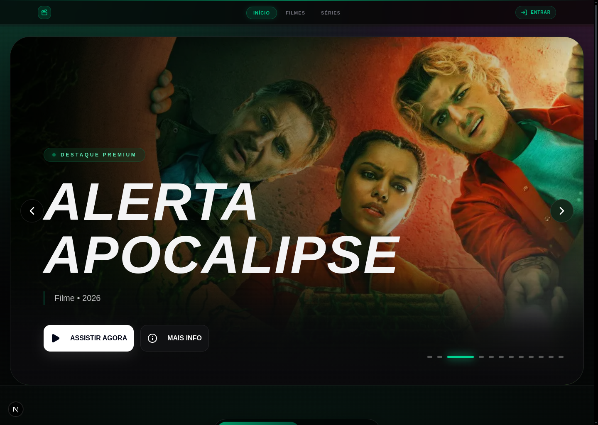

<h1 align="center">
  <br />
  🎬 CineNex
  <br />
</h1>

<p align="center">
  Plataforma de descoberta e reprodução de filmes e séries
</p>

<p align="center">
  
  
  
  
  
  
</p>

<br />

<p align="center">
  
</p>

<br />

## ✨ Funcionalidades

### 🎥 Catálogo & Descoberta
- Catálogo dinâmico via **TMDB Discover API** com filmes e séries em pt-BR
- Filtros por gênero (30+ gêneros para filmes, 20+ para séries), idioma e ordenação
- Ordenação por popularidade, data de lançamento, avaliação e ordem alfabética
- Pesquisa global com paleta de comandos (`Ctrl+K` / `Cmd+K`)
- Hero carousel rotativo com destaques: Trending, Lançamentos e Séries
- Linhas curadas: "Em alta agora", "Filmes Populares", "Séries para maratonar"
- Circuit breaker para falhas da API TMDB (3 falhas → pausa de 60s)
- Cache: trending 30min, detalhes 60min

### ▶️ Player de Vídeo
- Reprodução **HLS adaptativa** com `HLS.js` e suporte a `mpegts.js`
- Troca de qualidade automática (por condição de rede) e manual
- Controles de velocidade: 0.75×, 1×, 1.25×, 1.5×, 2×
- Barra de progresso com seeking e expansão ao hover
- Controle de volume com slider (0–100%)
- Fullscreen com duplo clique
- **Próximo episódio** com contagem regressiva de 10s e card de preview
- Navegação entre episódios e temporadas
- Alertas de sinal fraco com downgrade automático de qualidade
- Persistência de preferências do player via `localStorage`

### 🔐 Autenticação
- Login com **e-mail + senha** e **Google OAuth**
- Cadastro com validação e envio de e-mail de confirmação
- Verificação via **OTP** (código 6 dígitos)
- Recuperação e redefinição de senha
- Reenvio de e-mail de confirmação
- Heartbeat de sessão (rastreamento de último acesso)
- Proteção de rotas via middleware (proxy)

### ❤️ Favoritos & Progresso
- Favoritar/desfavoritar com atualização otimista (sem reload)
- Progresso de reprodução salvo por conteúdo e episódio
- Conclusão automática quando `progresso ≥ 90%` e `posição ≥ 30s`
- Histórico dos últimos 20 itens assistidos
- "Continuar assistindo" com posição e percentual preservados

### 🛠️ Painel Administrativo
- **Overview**: métricas em tempo real (usuários totais, ativos, uptime), gráficos de crescimento, favoritos e espectadores ao vivo
- **Usuários**: tabela paginada com busca, filtro por role, toggle ADMIN/USER, exclusão com confirmação e painel lateral de detalhes
- **Sistema**: health checks de PostgreSQL, Supabase Auth e TMDB API, modo manutenção, limpeza de cache e sessões
- **Conteúdo**: diagnóstico de erros do catálogo

### 🔍 SEO
- Sitemap dinâmico com os 24 principais filmes e séries
- `robots.txt` configurado (bloqueia `/admin`, `/api`, `/play`)
- Canonical, Open Graph e `metadataBase` por ambiente

---

## 🧱 Stack

| Camada | Tecnologias |
| --- | --- |
| **Framework** | Next.js 16 · React 19 · TypeScript 5 |
| **Estilo** | Tailwind CSS 4 · Framer Motion · Three.js / @react-three/fiber |
| **Estado** | Zustand 5 — auth, catálogo, favoritos, player |
| **Auth & DB** | Supabase Auth · Prisma 7 · PostgreSQL |
| **Player** | HLS.js · mpegts.js |
| **UI** | Radix UI · shadcn/ui · Recharts · Embla Carousel |
| **Testes** | Vitest · Testing Library · Playwright |

---

## 🗄️ Banco de dados

| Tabela | Descrição |
| --- | --- |
| `Profile` | Dados da conta (id = Supabase UID, email, role ADMIN/USER) |
| `Favorite` | Favoritos por usuário (type MOVIE/SERIES + contentId TMDB) |
| `WatchProgress` | Progresso por conteúdo/episódio (posição, percentual, conclusão) |
| `MaterializedSummary` | Cache JSON dos destaques da home (com expiração) |

RLS habilitado em todas as tabelas de usuário — cada usuário acessa apenas seus próprios dados.

---

## 🔒 Segurança

- **Row-Level Security (RLS)** no PostgreSQL via Supabase Auth (`auth.uid()`)
- **Rate limiting** em memória por IP com janela deslizante e varredura a cada 60s
- **Middleware** bloqueia acesso não autenticado a `/admin` e `/collection/favorites`
- Redireciona usuários autenticados para fora das páginas de login/cadastro

---

## 📋 Requisitos

- `Node.js 20+`
- `pnpm`
- Projeto Supabase configurado
- Banco PostgreSQL acessível pelo Prisma

---

## ⚙️ Configuração

```bash
pnpm install
cp .env.example .env.local
```

Variáveis principais:

| Variável | Obrigatória | Uso |
| --- | --- | --- |
| `NEXT_PUBLIC_SUPABASE_URL` | Sim | URL pública do projeto Supabase |
| `NEXT_PUBLIC_SUPABASE_ANON_KEY` | Sim | Chave pública do Supabase |
| `SUPABASE_SERVICE_ROLE_KEY` | Sim | Operações administrativas no backend |
| `DATABASE_URL` | Sim | Conexão principal do Prisma |
| `DIRECT_URL` | Sim | Conexão direta para migrations |
| `AUTH_REDIRECT_BASE_URL` | Sim em produção | Origem base para auth e `metadataBase` |
| `TMDB_API_KEY` ou `TMDB_BEARER_TOKEN` | Sim | Metadados e descoberta de conteúdo via TMDB |
| `SUMMARY_REFRESH_TOKEN` | Opcional | Protege refresh de summary |
| `OMDB_API_KEY` | Opcional | Enriquecimento adicional de metadados |
| `E2E_AUTH_EMAIL` | Opcional | Usuário E2E comum |
| `E2E_AUTH_PASSWORD` | Opcional | Senha E2E comum |
| `E2E_ADMIN_EMAIL` | Opcional | Usuário E2E admin |
| `E2E_ADMIN_PASSWORD` | Opcional | Senha E2E admin |

---

## 🚀 Desenvolvimento

```bash
pnpm dev
```

Build de produção:

```bash
pnpm build
pnpm start
```

---

## 📜 Scripts

| Comando | Descrição |
| --- | --- |
| `pnpm dev` | Ambiente de desenvolvimento |
| `pnpm build` | Gera Prisma Client e faz build de produção |
| `pnpm start` | Sobe a build |
| `pnpm lint` | ESLint |
| `pnpm test` | Testes unitários e integração |
| `pnpm test:watch` | Testes em watch |
| `pnpm test:coverage` | Cobertura de testes |
| `pnpm test:e2e` | Testes E2E com Playwright |
| `pnpm db:generate` | Gera o Prisma Client |

---

## 🗺️ Rotas principais

| Rota | Descrição |
| --- | --- |
| `/` | 🏠 Home e descoberta |
| `/collection/movies` | 🎬 Catálogo de filmes |
| `/collection/series` | 📺 Catálogo de séries |
| `/collection/favorites` | ❤️ Favoritos do usuário |
| `/view/[type]/[id]` | 📄 Página de detalhe |
| `/play/[type]/[id]` | ▶️ Reprodução |
| `/login` | 🔑 Login |
| `/register` | 📝 Cadastro |
| `/forgot-password` | 🔒 Recuperação de senha |
| `/reset-password` | 🔓 Redefinição de senha |
| `/verify-otp` | ✅ Validação de conta |
| `/admin` | 🛠️ Dashboard administrativo (overview) |
| `/admin/users` | 👥 Gestão de usuários |
| `/admin/system` | 💻 Informações do sistema |
| `/admin/content` | 📦 Diagnóstico de conteúdo |
| `/privacy` | 📃 Política de privacidade |
| `/terms` | 📃 Termos de uso |
| `/cookies` | 🍪 Política de cookies |

---

## 🔌 API

| Grupo | Endpoints |
| --- | --- |
| `/api/auth/*` | login, cadastro, logout, recuperação de senha, OTP, sessão, favoritos, watch progress |
| `/api/auth/oauth/google` | autenticação via Google OAuth |
| `/api/catalog/*` | grupos, listagem, metadata, summary, stream, stream-options |
| `/api/admin/*` | usuários, métricas, health, maintenance, sessões, cache, diagnóstico de erros |

---

## 🧪 Testes

Os testes ficam colocalizados por módulo dentro de `src/`.

- `*.test.ts` / `*.test.tsx` — unitários e integração
- `__e2e__/*.e2e.spec.ts` — fluxos E2E

```bash
pnpm test
pnpm test:coverage
pnpm test:e2e
```

---

## 📁 Estrutura

```text
src/
├── app/               # rotas, páginas, route handlers e E2E
├── components/        # componentes compartilhados
├── features/          # módulos por domínio (auth)
├── hooks/             # hooks reutilizáveis
├── infrastructure/    # integrações externas, db e clients
├── service/           # serviços de domínio (catálogo, auth, TMDB)
├── shared/            # helpers, auth, mídia, testing e tipos comuns
└── store/             # estado global com Zustand

prisma/                # schema e migrações
```

---

## 💡 Observações

- `AUTH_REDIRECT_BASE_URL` deve apontar para o domínio real em produção para `canonical`, `open graph` e redirects saírem corretos.
- O catálogo é carregado dinamicamente via TMDB Discover API; não há seed de conteúdo.
- IDs de conteúdo seguem o formato `tmdb_movie_<id>` e `tmdb_tv_<id>`.
- Os vídeos reproduzidos são de domínio público (Big Buck Bunny, Tears of Steel etc.) para fins de demonstração.

---

## 👤 Autor

[Vitor Firmino](https://github.com/VitorFirmino)
